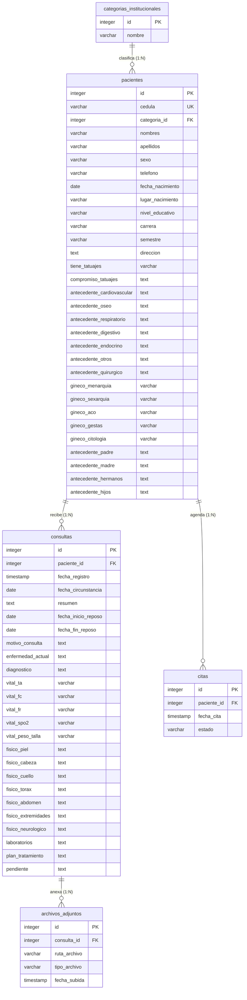

# Documentación Funcional y Técnica - Salud UNEFA

Esta documentación detalla el funcionamiento lógico y operativo del sistema **Salud UNEFA**, sus mecanismos de validación frontend y backend, la arquitectura física de su base de datos (PostgreSQL), el flujo de ejecución con Docker y la guía paso a paso para realizar modificaciones en las vistas, controladores, consultas SQL y reportes.

---

## 📖 PARTE 1: DOCUMENTACIÓN FUNCIONAL Y DE NEGOCIO

El sistema está diseñado como una aplicación web de una sola página (Single Page Application - SPA) intuitiva y fluida. Desde el panel lateral izquierdo, el personal médico puede navegar por las cuatro secciones funcionales principales.

### 1. Panel de Control (Dashboard)
El Dashboard proporciona un resumen analítico en tiempo real del estado de la institución médica:
* **Indicadores Dinámicos (KPIs):**
  - **Pacientes Registrados:** Total acumulado de expedientes en el sistema.
  - **Citas Pendientes:** Cantidad de citas agendadas que aún no han sido completadas o canceladas.
  - **Consultas del Mes:** Total de atenciones médicas registradas durante el mes en curso.
  - **Reposos Activos:** Cantidad de reposos vigentes (cuya fecha de fin es mayor o igual a la fecha de hoy).
* **Gráficos Estadísticos Interactivos (Chart.js):**
  - **Distribución por Categorías:** Gráfico de torta (Pie Chart) que agrupa y muestra la cantidad de pacientes según su categoría institucional (*Estudiante, Docente, Administrativo, Militar, Obrero*).
  - **Consultas Históricas:** Gráfico de barras (Bar Chart) con la cantidad mensual de consultas médicas para analizar tendencias de morbilidad.

### 2. Gestión de Pacientes e Historias Clínicas
Es el núcleo del sistema, optimizado para la consulta rápida y la recolección detallada de datos clínicos:
* **Búsqueda Dinámica:** Permite filtrar pacientes en tiempo real por número de Cédula de Identidad o por su Categoría Institucional de forma instantánea.
* **Expediente del Paciente (Drawer Lateral):** Al seleccionar un paciente, se despliega un panel lateral derecho que recupera de la base de datos:
  - Información general y demográfica.
  - Historial cronológico de consultas médicas con accesos rápidos para imprimir su **Historia Clínica**, **Informe Médico** o **Certificado de Reposo**.
  - Enlaces para descargar o previsualizar archivos/exámenes adjuntos cargados.
  - Registro de citas pasadas y futuras.
  - Accesos rápidos para abrir directamente el modal de nueva consulta o agendar una cita.
* **Formulario de Registro de Consulta (Estructura de Acordeón):** Para no saturar la pantalla, el formulario de consulta se subdivide en secciones colapsables interactivas:
  1. *Identificación:* Datos de contacto, datos demográficos, datos académicos (carrera/semestre para estudiantes) y nivel educativo.
  2. *Antecedentes:* Patologías personales (cardiovasculares, óseas, respiratorias, etc.), antecedentes quirúrgicos, antecedentes ginecobstétricos (menarquia, sexarquia, ACO, gestas, última citología) y antecedentes familiares (padre, madre, hermanos, hijos). También incluye una declaración de tatuajes y compromiso institucional.
  3. *Signos Vitales:* Presión Arterial (T.A.), Frecuencia Cardíaca (F.C.), Frecuencia Respiratoria (F.R.), Saturación de Oxígeno ($SpO_2$) y Peso/Talla.
  4. *Examen Físico:* Evaluación por sistemas (Piel, Cabeza, Cuello, Tórax, Abdomen, Extremidades, Neurológico).
  5. *Diagnóstico y Tratamiento:* Motivo de consulta, enfermedad actual, diagnóstico principal, plan terapéutico, laboratorios y exámenes complementarios solicitados, sección de reposo médico (con fecha de inicio y fin opcionales) y cargador de archivos adjuntos (recetas, exámenes digitalizados o informes en PDF, PNG o JPG).

> [!NOTE]
> **Botón "Actualizar sólo Paciente":**
> Si el médico solo desea corregir un dato del paciente (por ejemplo, el teléfono, carrera o dirección) sin crear una consulta médica completa, puede usar esta opción. El sistema guardará los cambios de la ficha de datos omitiendo la validación obligatoria de los campos clínicos.

---

### 3. Control y Agendamiento de Citas
* **Agendamiento:** Permite programar la fecha y hora de atención para un paciente.
* **Registro "Al Vuelo" (On the fly):** Si la Cédula ingresada en el modal de citas no existe en la base de datos, el sistema despliega automáticamente campos mínimos obligatorios (*Nombres, Apellidos, Categoría y Sexo*) para registrar al paciente en la base de datos en ese mismo instante, sin obligar al médico a salir del flujo de agendamiento.
* **Transiciones de Estado Lógicas:** Las citas inician en estado **Pendiente** y pueden ser marcadas como **Completadas** o **Canceladas** directamente desde la tarjeta del celular o la fila de la tabla en desktop.

---

### 4. Reportes de Morbilidad
* **Consolidado de Consultas:** Filtra todas las consultas realizadas en el centro de salud en un rango de fechas determinado.
* **Visualización Dual:** Muestra un resumen detallado del paciente, su carrera, el diagnóstico y el motivo de consulta.
* **Impresión en Formato Oficial:** Genera una hoja de cálculo imprimible que sirve de reporte para las estadísticas de la dirección de salud de la UNEFA.

---

### 🛡️ Validaciones del Sistema (Frontend y Backend)

El sistema cuenta con un blindaje en dos capas para garantizar la integridad y calidad de la información:

| Módulo / Campo | Validación Frontend (JS / HTML5) | Validación Backend (PHP - `save_registro.php` / `save_cita.php`) |
| :--- | :--- | :--- |
| **Cédula de Identidad** | Formato requerido: prefijo de nacionalidad/tipo (`V, E, J, G, C, P, N`) seguido de guion y dígitos. Autoformatea en tiempo real al escribir (ej. escribe `v26123456` y se convierte en `V-26123456`). | Limpia espacios y convierte a mayúsculas. Valida con la expresión regular `^[VEJGCPN]-[0-9]+$`. Verifica si el paciente ya existe en base de datos. |
| **Campos Básicos** | Campos `nombres`, `apellidos`, `categoria_id`, `sexo` marcados como `required`. | Verifica que no estén vacíos en la petición POST y que existan los IDs de categoría. |
| **Tensión Arterial** | Autoformatea al quinto dígito insertando la barra `/` (ej: `12080` se convierte en `120/80`). | Valida que cumpla estrictamente con la expresión regular `^\d{2,3}\/\d{2,3}$` (Sistólica/Diastólica). |
| **Fecha de Nacimiento** | Atributo `max` dinámico bloqueado a la fecha actual. Evita la selección de fechas futuras en el calendario. | Convierte a tiempo UNIX y valida: 1) Que no sea una fecha en el futuro. 2) Que la fecha no sea superior a 120 años en el pasado (evita años de nacimiento erróneos). |
| **Fecha de Circunstancia** | Atributo `max` dinámico bloqueado a la fecha actual del servidor. | Valida que no sea futura y que sea igual o posterior a la `fecha_nacimiento` del paciente. |
| **Signos Vitales Numéricos** | El navegador restringe la entrada a caracteres numéricos en inputs de tipo `number`. | Valida límites fisiológicos:<br>- **F.C.:** 0 a 300 lpm.<br>- **F.R.:** 0 a 100 rpm.<br>- **SpO2:** 0% a 100%. |
| **Rango de Reposo** | Validaciones al cambiar fechas. | Valida que si se ingresa `inicio_reposo` se obligue a ingresar `fin_reposo` (y viceversa). Además, valida que `inicio_reposo` sea menor o igual a `fin_reposo`. |
| **Archivos Adjuntos** | Control frontend mediante JS: Valida peso máximo de **10MB** y extensiones (`.jpg`, `.jpeg`, `.png`, `.pdf`) lanzando SweetAlert2 si es inválido. | Inspecciona la subida de archivos en el servidor (`$_FILES`). Valida que el archivo no contenga extensiones ejecutables o peligrosas y que el tipo MIME coincida con imágenes o PDF. |
| **Control de Citas** | Fecha y hora requerida (`datetime-local`). Bloquea horas pasadas en el selector frontend. | Valida formato de fecha correcto. Controla que no se agenden citas duplicadas para el mismo paciente el mismo día. |
| **Flujo de Reversión de Cita** | Las acciones de cambiar estado están restringidas visualmente en tarjetas/tablas. | **Seguridad de Estado Terminal:** En `update_cita_estado.php` se bloquea el cambio de estado de "Completada" o "Cancelada" de vuelta a "Pendiente" para usuarios comunes. Solo un **Administrador** tiene privilegios para revertir este estado. |
| **Fechas de Morbilidad** | JS valida que se ingresen ambas fechas y que `fecha_inicio <= fecha_fin`. | `get_morbilidad.php` y `print_morbilidad.php` validan en servidor que las fechas estén presentes y que la fecha de inicio no sea mayor a la de fin antes de realizar la consulta SQL. |

---

## 🛠️ PARTE 2: DOCUMENTACIÓN TÉCNICA Y DESARROLLO

## 🐳 1. Arquitectura de Infraestructura (Docker Compose)

El sistema se ejecuta en un entorno completamente aislado y reproducible compuesto por dos contenedores Linux:

```
                  [ Navegador Web ]
                          │
                   Puerto 8080:80
                          ▼
            ┌───────────────────────────┐
            │    Contenedor Apache/PHP  │ (Servicio 'web')
            │      (unefa_web)          │
            └─────────────┬─────────────┘
                          │
                 Puerto Interno 5432
                          ▼
            ┌───────────────────────────┐
            │   Contenedor PostgreSQL 15│ (Servicio 'db')
            │      (unefa_db)           │
            └─────────────┬─────────────┘
                          │
                 Persistencia de Datos
                          ▼
                 [ postgres_data ] (Volumen Docker)
```

### Detalle de los Servicios en `docker-compose.yml`

1. **Apache/PHP (`unefa_web`):**
   - **Base:** Construido a partir del archivo [Dockerfile](file:///c:/Users/info-analista-bi/Documents/Proyecto-Unefa/docker/php/Dockerfile) usando `php:8.2-apache`.
   - **Configuración PHP:** Habilita el módulo de reescritura de Apache (`mod_rewrite`) e instala las librerías del sistema `libpq-dev`, `libpng-dev`, `libjpeg-dev`, `libfreetype6-dev` (para el procesamiento de imágenes GD) y `zip`/`unzip`. Instala las extensiones PHP `pdo`, `pdo_pgsql`, `pgsql` y `gd`.
   - **Volúmenes:**
     - `./src:/var/www/html`: Monta la carpeta local del código fuente directamente en el servidor web. Los cambios en el código se reflejan instantáneamente sin reiniciar el contenedor.
     - `./docker/php/uploads.ini:/usr/local/etc/php/conf.d/uploads.ini`: Configura límites de subida de archivos grandes (ej. 10MB).
   - **Variables de Entorno:** Define las credenciales del host, puerto y base de datos de PostgreSQL.

2. **PostgreSQL (`unefa_db`):**
   - **Base:** `postgres:15-alpine` (una distribución muy ligera de Linux optimizada para bases de datos).
   - **Persistencia:** Mapea el volumen nombrado de Docker `postgres_data` a `/var/lib/postgresql/data`. Esto asegura que si detienes los contenedores, los expedientes clínicos y citas no se borren.
   - **Inicialización:** Monta el script SQL de creación de base de datos `./docker/postgres/init.sql` dentro del directorio de autoejecución `/docker-entrypoint-initdb.d/`. Al levantar el contenedor por primera vez, este archivo crea las tablas, relaciones y datos iniciales automáticamente.

### Cómo Levantar el Servicio

Para poner en marcha la aplicación localmente, asegúrate de tener instalado **Docker** y **Docker Desktop** (en Windows) o el motor Docker en Linux, y sigue estos pasos:

1. **Iniciar el Servicio:** Abre una terminal o consola de comandos en la carpeta raíz del proyecto (`Proyecto-Unefa`) y ejecuta:
   ```bash
   docker compose up -d --build
   ```
   *El parámetro `-d` inicia los contenedores en segundo plano (detached mode) y `--build` asegura que se compile el Dockerfile con las extensiones requeridas.*

2. **Acceder a la Aplicación:** Abre tu navegador web e ingresa a:
   ```text
   http://localhost:8080
   ```

3. **Detener el Servicio:** Para apagar los servidores de forma segura y liberar la memoria RAM de tu computadora:
   ```bash
   docker compose down
   ```
   *Nota: Esto detiene los contenedores pero mantiene a salvo la base de datos en el volumen persistente.*

---

## 🗄️ 2. Modelo de Base de Datos y Consultas SQL

### Diagrama Entidad-Relación Físico (PostgreSQL)

El esquema relacional está diseñado para soportar la integridad referencial y las búsquedas eficientes:



### Consultas SQL Principales del Sistema

1. **Obtener lista de pacientes con su fecha de última consulta:**
   Esta consulta optimiza el renderizado de la tabla principal de pacientes para ver rápidamente cuándo fue su última atención médica:
   ```sql
   SELECT 
       p.*, 
       c.nombre AS categoria,
       (SELECT MAX(fecha_registro) FROM consultas WHERE paciente_id = p.id) as ultima_consulta
   FROM pacientes p
   JOIN categorias_institucionales c ON p.categoria_id = c.id
   ORDER BY p.id DESC
   ```

2. **Obtener la historia clínica consolidada del paciente (Datos del expediente):**
   ```sql
   SELECT p.*, c.nombre AS categoria 
   FROM pacientes p
   JOIN categorias_institucionales c ON p.categoria_id = c.id
   WHERE p.id = ?
   ```

3. **Reporte de Morbilidad por rango de fechas:**
   Filtra las consultas y los pacientes asociados en un rango cronológico seleccionado por el usuario:
   ```sql
   SELECT 
       c.*, 
       p.cedula, p.nombres, p.apellidos, p.sexo, p.fecha_nacimiento, p.carrera, p.semestre, p.telefono, p.direccion,
       cat.nombre AS categoria
   FROM consultas c
   JOIN pacientes p ON c.paciente_id = p.id
   JOIN categorias_institucionales cat ON p.categoria_id = cat.id
   WHERE c.fecha_circunstancia BETWEEN ? AND ?
   ORDER BY c.fecha_circunstancia ASC, c.id ASC
   ```

---

## 💻 3. Guía de Modificaciones: ¿Dónde realizar cambios?

Si necesitas expandir el sistema o hacer ajustes estéticos y funcionales, esta guía te muestra exactamente qué archivos debes tocar:

### A. Para modificar Consultas SQL y Lógica de Servidor (Backend)
Todos los servicios del servidor están organizados en el directorio [src/api/](file:///c:/Users/info-analista-bi/Documents/Proyecto-Unefa/src/api):

* **Guardar/Modificar Pacientes y Consultas:** Edita [save_registro.php](file:///c:/Users/info-analista-bi/Documents/Proyecto-Unefa/src/api/save_registro.php). 
  - Si añades una nueva validación en el servidor, agrégala dentro del array `$errors` para que el frontend pueda pintarla en línea bajo el input correcto.
  - El archivo maneja una **transacción PDO** (`$db->beginTransaction()`). Si falla la inserción de los adjuntos o de la consulta, la base de datos se revierte automáticamente (`$db->rollBack()`), evitando la corrupción de datos.
* **Agendamiento y Registro al Vuelo:** Edita [save_cita.php](file:///c:/Users/info-analista-bi/Documents/Proyecto-Unefa/src/api/save_cita.php).
  - Aquí se procesa el registro rápido de pacientes no existentes y la creación de citas.
* **Estadísticas del Dashboard:** Edita [get_stats.php](file:///c:/Users/info-analista-bi/Documents/Proyecto-Unefa/src/api/get_stats.php).
  - Modifica las consultas SQL si quieres agregar nuevos KPI, por ejemplo, estadísticas de pacientes por sexo, carreras con más consultas, etc.
* **Conexión a Base de Datos:** Edita [Database.php](file:///c:/Users/info-analista-bi/Documents/Proyecto-Unefa/src/config/Database.php).
  - Utiliza el patrón de diseño **Singleton** para evitar abrir múltiples conexiones simultáneas a PostgreSQL.

---

### B. Para modificar la Interfaz Visual y Maquetación (HTML/PHP)
La estructura base está contenida en [src/index.php](file:///c:/Users/info-analista-bi/Documents/Proyecto-Unefa/src/index.php), el cual carga el layout principal e incluye de manera modular los siguientes archivos:

* **Estructura General (Layout):**
  - **Head y Librerías:** [head.php](file:///c:/Users/info-analista-bi/Documents/Proyecto-Unefa/src/components/head.php). Inclusión de Tailwind CSS y tipografías externas.
  - **Barra Lateral:** [sidebar.php](file:///c:/Users/info-analista-bi/Documents/Proyecto-Unefa/src/components/sidebar.php). Modifica el menú de navegación y los enlaces a los módulos.
  - **Barra Superior:** [header.php](file:///c:/Users/info-analista-bi/Documents/Proyecto-Unefa/src/components/header.php). Títulos dinámicos de sección y fecha actual.
  - **Footer:** [footer.php](file:///c:/Users/info-analista-bi/Documents/Proyecto-Unefa/src/components/footer.php). Cierre de etiquetas HTML y carga en orden de los controladores JS.
* **Vistas de Contenido:**
  - **Panel de Control:** [dashboard.php](file:///c:/Users/info-analista-bi/Documents/Proyecto-Unefa/src/views/dashboard.php). Tarjetas informativas y lienzos `<canvas>` para los gráficos.
  - **Módulo Pacientes:** [pacientes.php](file:///c:/Users/info-analista-bi/Documents/Proyecto-Unefa/src/views/pacientes.php). Listado principal de pacientes, buscador y filtros.
  - **Módulo Citas:** [citas.php](file:///c:/Users/info-analista-bi/Documents/Proyecto-Unefa/src/views/citas.php). Contenedores de la vista de citas médicas.
  - **Módulo Reportes:** [reportes.php](file:///c:/Users/info-analista-bi/Documents/Proyecto-Unefa/src/views/reportes.php). Rango de fechas de morbilidad y listado de resultados.

> [!IMPORTANT]
> **Estructura Dual Responsiva (Mobile-First):**
> Al modificar las listas de Pacientes, Citas o Reportes, notarás que las vistas cuentan con un diseño doble:
> 1. Para pantallas medianas y grandes (`hidden md:block`), se renderiza una estructura de tabla HTML convencional.
> 2. Para pantallas de teléfonos inteligentes (`md:hidden`), se define una rejilla (`grid grid-cols-1 sm:grid-cols-2 gap-4`) donde JavaScript inyectará dinámicamente **tarjetas interactivas de diseño premium**. Si agregas columnas a la tabla de escritorio, recuerda agregar el dato equivalente en la tarjeta móvil respectiva dentro del archivo JavaScript.

---

### C. Para modificar Formularios, Modales y Cajones (Drawers)
Están alojados de forma modular en [src/modals/](file:///c:/Users/info-analista-bi/Documents/Proyecto-Unefa/src/modals):

* **Modal de Historia Clínica (Consulta):** [consulta_modal.php](file:///c:/Users/info-analista-bi/Documents/Proyecto-Unefa/src/modals/consulta_modal.php). Contiene el formulario dividido en secciones colapsables (acordeón).
  - Si deseas agregar un nuevo campo de entrada, asegúrate de asignarle un atributo `name` idéntico al que procesará PHP en el backend.
  - **Ergonomía Táctil Móvil:** Los inputs del formulario deben mantener las clases de tamaño `text-base sm:text-sm`. Esto garantiza que en pantallas móviles el tamaño sea de mínimo `16px` (evitando que iOS/Safari aplique un molesto zoom automático al enfocar el elemento) y en computadoras de escritorio pase a `14px` (se ve más compacto y elegante).
* **Modal de Citas:** [cita_modal.php](file:///c:/Users/info-analista-bi/Documents/Proyecto-Unefa/src/modals/cita_modal.php). Formulario de agendamiento y campos dinámicos para el "Registro al Vuelo".
* **Expediente del Paciente:** [patient_drawer.php](file:///c:/Users/info-analista-bi/Documents/Proyecto-Unefa/src/modals/patient_drawer.php). Panel lateral deslizable derecho que muestra el historial de salud.

---

### D. Para modificar la Lógica Dinámica y el Frontend (JavaScript)
Los archivos se encuentran en [src/js/](file:///c:/Users/info-analista-bi/Documents/Proyecto-Unefa/src/js) y procesan las peticiones AJAX/Fetch al backend y manipulan el DOM:

* **Controlador General:** [app.js](file:///c:/Users/info-analista-bi/Documents/Proyecto-Unefa/src/js/app.js).
  - Define la navegación de pestañas (`switchTab()`), notificaciones toast, cargador de acordeón y formateador dinámico de Cédulas y T.A.
* **Controlador de Pacientes:** [pacientes.js](file:///c:/Users/info-analista-bi/Documents/Proyecto-Unefa/src/js/pacientes.js).
  - Modifica la función `renderTable(data)` para cambiar el diseño de la tabla de escritorio o el HTML generado dinámicamente para las **tarjetas premium de móviles** en el bloque de comentarios `// ── TARJETA MÓVIL (visible solo en < md) ──`.
  - Procesa el autocompletado inteligente del paciente por cédula en tiempo real.
* **Controlador de Citas:** [citas.js](file:///c:/Users/info-analista-bi/Documents/Proyecto-Unefa/src/js/citas.js).
  - Administra el cambio de estados, validaciones al vuelo y el renderizado responsivo en `renderCitasTable(data)`.
* **Controlador de Gráficos (Dashboard):** [dashboard.js](file:///c:/Users/info-analista-bi/Documents/Proyecto-Unefa/src/js/dashboard.js).
  - Inicializa las instancias de Chart.js y gestiona los colores, bordes y tooltips de los gráficos analíticos.

---

### E. Para modificar los Reportes e Impresión (PDF)
A diferencia de los sistemas tradicionales que utilizan librerías rígidas de PHP como FPDF o TCPDF (las cuales requieren calcular coordenadas manuales milimétricas e impiden la adaptabilidad), los reportes de Salud UNEFA están desarrollados como **páginas web limpias en HTML y Tailwind CSS, optimizadas para impresión nativa del navegador**:

Los scripts generadores se encuentran en:
- **Expediente Clínico / Historia:** [print_historia.php](file:///c:/Users/info-analista-bi/Documents/Proyecto-Unefa/src/api/print_historia.php).
- **Informe Médico Individual:** [print_informe.php](file:///c:/Users/info-analista-bi/Documents/Proyecto-Unefa/src/api/print_informe.php).
- **Certificado de Reposo Médico:** [print_reposo.php](file:///c:/Users/info-analista-bi/Documents/Proyecto-Unefa/src/api/print_reposo.php).
- **Planilla de Morbilidad Consolidada:** [print_morbilidad.php](file:///c:/Users/info-analista-bi/Documents/Proyecto-Unefa/src/api/print_morbilidad.php).

#### Cómo personalizar la impresión (Márgenes, Logotipos, Orientación):
1. **Orientación y Dimensiones de la Página:** Se controlan desde las directivas CSS `@media print` en la cabecera `<style>` del reporte respectivo:
   ```css
   @media print {
       @page {
           size: landscape; /* horizontal para Morbilidad */
           /* size: portrait; (vertical para Informe y Reposo) */
           margin: 1.2cm; /* Margen físico de impresión */
       }
       .no-print {
           display: none; /* Oculta botones o cabeceras del sistema al imprimir */
       }
   }
   ```
2. **Logotipos y Encabezados Institucionales:** Las imágenes y textos de membrete están maquetados con flexbox y cuadrículas comunes de Tailwind. Para reemplazarlos o ajustar el tamaño, edita las clases HTML correspondientes.
3. **Firmas y Sellos:** Al final de los reportes se encuentran contenedores con clases como `border-t border-dashed` que definen el espacio físico para la firma del médico y el sello institucional, diseñados para no desbordarse de la hoja.
